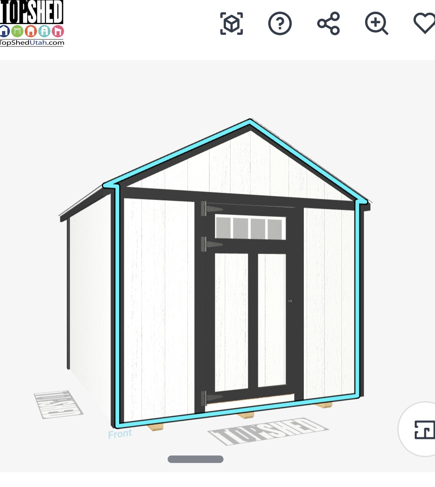

# The Craftsman door

This is the door the Craftsman style in `designer.html` is built to match. It
is here because the first version was built from the *idea* of a Craftsman
door rather than from this photo, and the difference is not obvious from the
code — someone reading `addOverlays` a year from now would have no way to know
why the obvious textbook detail is deliberately absent.

## What the reference has, top to bottom

| | |
|---|---|
| **Head cap** | A thin shelf **above** the glass, the full width of the leaf, standing proud of the face. |
| **Four lites** | A band about 9.5in deep, divided by three muntins. Four panes, not three. |
| **A plain rail** | Under the glass. Nothing hangs off it. |
| **Two tall panels** | Split by a centre stile, running most of the leaf. |
| **A deep bottom rail** | Noticeably deeper than the rails above it. |
| **Short straps, on the rails** | Three of them, about half the length of a barn strap, and each one level with a rail: the top rail above the lites, the rail under them, and the bottom rail. |
| **The handle** | NOT taken from the photo. The T-handle stays, the same as every other shed door — see below. |

## What the first version had, and why it was wrong

A textbook Craftsman entry door has **three** lites over a **dentil shelf** —
a shelf that projects from the face with a row of small square blocks beneath
it. That is a real and correct description of the style, it is what the code
was written to, and it is not this door.

The shelf was also on the wrong side of the glass. In the reference the
projecting piece is *over* the lites; the dentil shelf sits *under* them. So
the one part that stood off the face stood off it in the wrong place.

The other half of it was hardware, and this is worth reading carefully because
the obvious fix was also wrong.

The Craftsman was in the shed-door family, so it got the full-size decorative
T-strap: about nine inches of iron reaching a third of the way across the leaf
and over the panels, plus a T-handle, which is what goes on a barn. The first
correction replaced the straps with small butt hinges, reasoning that a
Craftsman is a residential entry door. Enlarge the photo and there are straps
on it — top, middle and bottom. **The species was right. The size was wrong.**
0.55 scale puts the plate at 2.6in and the reach at about 4.2in, which is what
the photo measures, and keeps the tip clear of the glass at every leaf width.

Then **where** they hang. `hingeYs` spreads hinges evenly over whatever part of
the leaf is not glass, which is all it was written to do — it exists because a
strap once landed across the cedar door's transom lites. Even spacing put the
middle strap in the middle of a panel, with nothing behind it to screw into. In
the reference all three are fitted to rails. `craftRailYs()` is now the single
source for those heights: `addOverlays` draws the rails from it and the
hardware hangs the straps from it, so they cannot drift apart.

Only the hinges moved. The frame, jamb and panel materials are still the shed
door's, because that is what the door is built out of — and so is the handle.

**The handle and latch do not change with the style.** The photo has a small
round knob and this briefly copied it, which was reading the reference too
literally: it is a picture of a competitor's door, not a parts list, and the
T-handle with the lock in the plate is the hardware that actually gets fitted.
The door style changes the door. It does not change what you grab.

## Where it lives

- `glassRegion()` — the 9.5in band and the 5.5in of rail above it, sized in
  inches so the band does not grow into half the door on an 84in leaf.
- `addOverlays()`, the `DOOR==='craftsman'` branch — the cap, the muntins, the
  rail and the panels.
- `craftRailYs()` — the three rail heights, read by both the drawing and the
  hardware.
- the hardware branch — `isCraft` sets the strap scale and hangs them off
  `craftRailYs()`. It does not touch the handle.
- `tests/geometry/craftsmandoor.test.mjs` — each row of the table above, as a
  check against the geometry rather than against the numbers that placed it.
